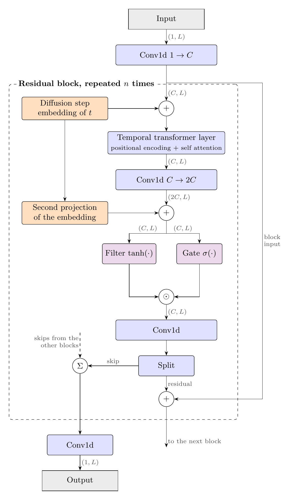

# Generative Modelling of Financial Time Series

### Score-based diffusion models on S&P 500 log returns

Code for an MSc Financial Mathematics dissertation (Queen Mary University of
London, 2026) — see [Citation](#citation).

---

A score network
combining a residual convolutional backbone with temporal self-attention is
trained by denoising score matching under the Variance-Exploding (VE) SDE on
sixty-nine years of standardised S&P 500 daily log returns. Nine models,
spanning three training-data volumes and three model capacities, are sampled
with both a stochastic Predictor–Corrector method and a deterministic
probability-flow ODE, and the generated series are evaluated along two
complementary axes: the stylized facts of asset returns, and distributional
similarity measured by marginal and window-level diagnostics together with
three sample-based statistical distances.

---

## Contents

- [Overview](#overview)
- [Repository structure](#repository-structure)
- [Installation](#installation)
- [Quick start](#quick-start)
- [Configuration and experimental setup](#configuration-and-experimental-setup)
- [Model](#model)
- [Samplers](#samplers)
- [Evaluation](#evaluation)
- [Reproducibility](#reproducibility)
- [Summary of findings](#summary-of-findings)
- [Citation](#citation)
- [License](#license)

---

## Overview

The workflow is three notebooks, executed in order:

| Notebook | Purpose | Produces |
|---|---|---|
| `01_training.ipynb` | Download the S&P 500 series, build the windowed dataset, train the score network | `checkpoints/<run>.pt`, loss curve |
| `02_sampling.ipynb` | Load a checkpoint and generate synthetic return windows with the PC or ODE sampler | `gen_data/gs_<sampler>_<run>.pt`, sample-path figures |
| `03_evaluation.ipynb` | Evaluate generated samples: stylized facts, distribution diagnostics, C2ST, sliced Wasserstein, MMD | tables, figures, cached real-data benchmarks |

All reusable logic lives in the Python packages; the notebooks are thin,
documented orchestration layers, so every result is reproducible from the
packages alone.

---

## Repository structure

```
.
├── 01_training.ipynb            # train the score network
├── 02_sampling.ipynb            # generate samples from a checkpoint
├── 03_evaluation.ipynb          # evaluation suite
├── config.py                    # data + model hyperparameters (single source of truth)
│
├── data/                        # data acquisition and windowing
│   ├── data.py                  #   get_data(): validated download → cleaning → daily log returns
│   └── daily_log_returns_data.py#   DailyLogReturnsData: standardised sliding-window Dataset
│
├── model/                       # score network
│   ├── score_network.py         #   ScoreNet: input conv → residual stack → skip aggregation → output conv
│   ├── residual_block.py        #   gated residual block with temporal transformer
│   ├── temporal_transformer.py  #   multi-head self-attention over the time axis
│   ├── utils.py                 #   diffusion-step, positional and time embeddings
│   ├── config.py                #   default constructor arguments of the model classes
│   └── train_network.py         #   noise schedule, DSM loss, training loop
│
├── sampling/                    # reverse-SDE integrators
│   ├── predictor_corrector.py   #   PC_sampler (predictor + Langevin corrector)
│   ├── ODE_sampler.py           #   ODE_sampler: probability flow with Heun's method
│   ├── annealed_LD.py           #   ALD_sampler (reference implementation, not used in the experiments)
│   └── utils.py                 #   shared noise schedule
│
├── evaluation/                  # evaluation methods
│   ├── utils.py                 #   make_eval_chunks, kernel helpers
│   ├── stylized_facts/          #   real benchmark, comparison tables, multi-model curves
│   ├── c2st.py                  #   classifier two-sample test
│   ├── discriminator/           #   GRU discriminator for C2ST
│   ├── swd.py                   #   sliced Wasserstein distance
│   ├── mmd.py, mmd_pooled.py    #   maximum mean discrepancy (+ pooled-real diagnostic)
│   ├── ffad.py, autoencoder/    #   not used in the dissertation
│
├── plots/                       # figure utilities
│   ├── plots.py                 #   sample paths, price and log-return series, loss curve
│   ├── distribution_explorer.py #   marginal density, QQ, tail survival, per-window statistics
│   └── diagnostics_plots.py     #   stylized-fact diagnostics on the raw series
│
├── checkpoints/                 # trained models (git-ignored)
├── gen_data/                    # generated samples (git-ignored)
├── benchmarks/                  # cached real-data benchmarks (git-ignored)
├── figures/, tables/            # outputs (git-ignored)
│
├── requirements.txt             # pinned environment
├── pyproject.toml               # package metadata
└── LICENSE
```

---

## Installation

Python ≥ 3.10. A GPU is optional; the code selects CUDA, then Apple MPS, then CPU.

```bash
git clone <repository-url>
cd <repository-directory>

python -m venv .venv
source .venv/bin/activate          # Windows: .venv\Scripts\activate

pip install -r requirements.txt    # pinned versions used for the dissertation
pip install -e .                   # makes data/, model/, sampling/, evaluation/, plots/ importable
```

The S&P 500 series is downloaded on first use via `yfinance`; no dataset is bundled.

---

## Quick start

Run the three notebooks in order from the repository root. Minimal
programmatic equivalent:

```python
import torch
from config import data_config, model_config
from data import get_data, DailyLogReturnsData
from model import ScoreNet, train_net
from sampling import PC_sampler

# 1. data: S&P 500 daily log returns, standardised, windowed
returns = get_data({"ticker": data_config["TICKER"],
                    "start": data_config["START"], "end": data_config["END"]})["log_return"]
ds = DailyLogReturnsData(returns, window_size=256, stride=20, normalize=True)   # dataset D3
X = torch.stack([ds[i].squeeze(0) for i in range(len(ds))])                    # (n_windows, 256)

# 2. model (Conf. 1) and training
net = ScoreNet(channels=64, diffusion_dim=128, num_heads=8, num_blocks=1, kernel_size=3)
train_net(X, net, {"iter": 100, "batch_size": 64, "lr": 1e-3, "log_every": 10,
                   "save_path": "checkpoints/conf1_s20.pt", "device": model_config["DEVICE"]},
          model_config)

# 3. sampling (Predictor–Corrector)
net.eval()
samples = PC_sampler(net, dict(noise_levels=100, steps=3, snr=0.16,
                               dim=256, num_samples=1000), seed=42)
```

---

## Configuration and experimental setup

All hyperparameters are set in **`config.py`**:

```python
data_config  = dict(TICKER="^GSPC", START="1957-01-01", END="2026-06-16",
                    WINDOW_SIZE=256, STRIDE=1)

model_config = dict(CHANNELS=64, DIFFUSION_DIM=128, NUM_HEADS=8,
                    NUM_TF_LAYERS=1, NUM_RES_BLOCKS=2, KERNEL_SIZE=3, ...)
```

`model/config.py` holds the *default* constructor arguments of the model
classes and is not the run configuration; the notebooks always pass explicit
values from the top-level `config.py`. `NUM_HEADS` must divide `CHANNELS`.
Checkpoints store both configuration dictionaries, and the sampling and
evaluation notebooks rebuild the network from the checkpoint.

### Data

Daily S&P 500 closing prices from 1 January 1957 to 16 June 2026 (17,479
log returns), standardised to zero mean and unit variance, and split into
sliding windows of length 256. The stride controls the number and overlap of
the training windows.

| Dataset | Stride | Windows | Window length |
|---|---|---|---|
| D1 | 1 | 17,224 | 256 |
| D2 | 10 | 1,723 | 256 |
| D3 | 20 | 862 | 256 |

### Model configurations

| Config | Conv. channels | Residual blocks | Parameters |
|---|---|---|---|
| Conf. 1 (base) | 64 | 1 | 202,561 |
| Conf. 2 | 64 | 2 | 310,145 |
| Conf. 3 | 128 | 2 | 1,005,057 |

All configurations use one transformer layer with 8 attention heads and a
128-dimensional diffusion-step embedding.

### Training

σ_min = 0.01, σ_max = 10, T = 1, t ~ U(0, T), batch size 64, learning rate
0.001, Adam. With unit-variance data, σ_max = 10 gives a variance-based
signal-to-noise ratio of 0.01 at the terminal distribution.

**Naming convention.** Runs are named `conf<k>_s<stride>_noise<σmax>_seed<seed>`;
generated samples are prefixed with the sampler, e.g.
`gen_data/gs_PC_conf1_s20_noise10_seed0.pt`.

---

## Model

<p align="center">
  
</p>
<p align="center"><em>Score network architecture: gated residual blocks with a temporal
transformer, diffusion-step and time conditioning, and skip aggregation.
Adapted from Tashiro et al. (2021).</em></p>

A residual convolutional backbone in the style of WaveNet/DiffWave, with the
CSDI temporal transformer layer in each block (Tashiro et al., 2021), adapted
to univariate return windows:

```
x (1, L) → Conv1d (1→C) → [ gated residual block ] × n → Σ skips → Conv1d → Conv1d (C→1)

each block:  + diffusion-step embedding of t
             + positional encoding → temporal self-attention
             Conv1d (C→2C)  + second projection of the embedding
             tanh(filter) ⊙ sigmoid(gate)                      ← gated activation unit
             Conv1d → split → residual (to next block), skip (to output)
```

Training minimises the σ²-weighted denoising score matching objective under
the exponential noise schedule σ(t) = σ_min (σ_max/σ_min)^t; the network is
conditioned on the continuous diffusion time *t*.

The accompanying dissertation also establishes that classical Geometric
Brownian Motion with constant volatility on log prices is an exact special
case of the VE SDE with noise scale σ√t, at the level of the transition
kernel, the score and the training objective; the experiments relax the
constant-volatility restriction and use the unconstrained VE SDE.

---

## Samplers

Both samplers integrate the reverse VE-SDE from t = T down to t = 0 on a
grid of K noise levels (Song et al., 2021).

| Sampler | Method | Noise levels | Corrector steps | NFE |
|---|---|---|---|---|
| `PC_sampler` | Reverse-diffusion predictor + Langevin corrector with SNR-based step size r = 0.16 | K = 100 | m = 3 | 400 |
| `ODE_sampler` | Probability-flow ODE with Heun's second-order method and an optional final denoising step | K = 30 | — | 60 |
| `ALD_sampler` | Annealed Langevin dynamics | — | — | ~10,000 |

PC sampling was preferred over ALD as the stochastic sampler because it is
more efficient; ALD is included as a reference implementation only. Both PC
and ODE sampling were applied to all nine configuration–dataset
combinations, generating 1000 samples of length 256 each.

---

## Evaluation

Two complementary axes:

**Stylized facts** (`evaluation/stylized_facts/`). Linear unpredictability
(ACF of returns), heavy tails (excess kurtosis), volatility clustering (ACF
of absolute returns) and the leverage effect corr(r_t, |r_{t+k}|), tabulated
at lags 1, 10 and 20 and plotted over lags 1–50 against the real data.

**Distributional similarity.** Marginal diagnostics (density, log-density,
standardised QQ and tail-survival plots) and per-window statistics
(`plots/distribution_explorer.py`), together with three sample-based
distances: sliced Wasserstein SW₁ (`swd.py`), unbiased MMD² with a
multi-scale Gaussian kernel and median-heuristic bandwidth (`mmd.py`;
Gretton et al., 2012), and a classifier two-sample test with a two-layer GRU
discriminator trained with early stopping (`c2st.py`; Lopez-Paz & Oquab,
2017).

**Calibration.** The stride-1 real windows are split by
`evaluation.utils.make_eval_chunks` into 17 disjoint, seed-fixed chunks of
1000 windows. Every statistic is computed per chunk, giving a real-vs-real
benchmark with a mean and standard deviation, and results are reported as
z-scores against that benchmark, z = (generated − real mean) / real std.
Distances are additionally
anchored by a real-vs-Gaussian reference. For C2ST a separate, identically
configured classifier is trained for each comparison (real vs real, real vs
Gaussian, real vs generated).

Statistical safeguards: sliced Wasserstein compares equal-sized sets (its
finite-sample bias depends on the sample size); the unbiased MMD² is reported
unclamped, so a slightly negative real-vs-real value is expected; hypothesis
tests (Jarque–Bera, ARCH-LM) are aggregated as rejection rates, never as
averaged p-values; and all estimators are applied identically to real and
generated data at the same window length.

---

## Reproducibility

- **Seeds.** Chunking, sampling, training and every evaluation take an explicit `seed`; `seed=42` is used throughout.
- **Benchmarks** are cached to `benchmarks/*.json`, keyed by chunk size; the loader refuses a cache whose chunk size does not match.
- **Checkpoints are self-describing**: they contain `model_config`, `train_config`, the optimiser state and the loss history.
- **Environment:** `requirements.txt` pins the exact versions used.
- **Hardware:** results were produced on Apple MPS; CUDA and CPU runs are numerically equivalent up to floating-point ordering.

Large artefacts (`checkpoints/`, `gen_data/`, `figures/`, `tables/`,
`benchmarks/`) are git-ignored and regenerated by the notebooks.

---

## Summary of findings

- **Stylized facts follow a clear order of difficulty.** Linear
  unpredictability is reproduced by every combination; heavy tails require
  sufficient training data and model capacity (the largest model on D1 gives
  the tightest match, excess kurtosis 3.31 ODE / 3.16 PC against 3.34 real);
  persistent volatility clustering is retained only by the larger models on
  the larger datasets or through the stochastic sampler. The leverage effect
  is substantially attenuated beyond lag 10 by every combination.
- **Training-data volume is the principal determinant of performance**, and
  additional capacity helps only when supported by sufficient data.
- **The samplers trade off temporal realism against distributional
  calibration.** PC sampling preserves the persistence of volatility
  clustering but compresses dispersion; ODE sampling reproduces the scale of
  returns more accurately but loses part of the temporal persistence.
- **The two evaluation axes are complementary.** D1 models score worse than
  D2 models on SW₁ and MMD despite better stylized facts, and a standard
  Gaussian baseline attains competitive distances while being trivially
  separated by the classifier (accuracy 0.99). Distributional distances alone
  are therefore not an adequate measure of financial time-series fidelity.
- No configuration dominates every criterion; the largest model trained on
  D1 and sampled with the ODE performs strongest on the stylized facts and
  marginal fit.

---

## Citation

If you use this code, please cite the dissertation:

```bibtex
@mastersthesis{angwah2026generative,
  title  = {Generative Modelling of Financial Time Series: Score-based diffusion models on {S\&P} 500 log returns},
  author = {Angwah, Randolph Nkonda},
  school = {Queen Mary University of London},
  year   = {2026},
  type   = {MSc dissertation},
  note   = {Supervisor: Dr Adrian Baule}
}
```

The methodology builds on score-based generative modelling through SDEs
(Song et al., 2021), the CSDI residual block (Tashiro et al., 2021), the
WaveNet/DiffWave residual architecture, and the stylized facts of asset
returns (Cont, 2001).

---

## License

Released under the MIT License — see [`LICENSE`](LICENSE).
